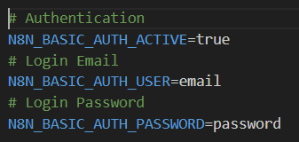

# n8n Setup Guide

This guide explains how to install and set up a local instance of n8n for workflow automation.

## Prerequisites

* Node.js and npm installed on your system.

## Setup n8n with npm

1.  **Install n8n** using npm.

    ```
    npm install n8n -g
    ```

2.  **Start n8n** for the first time. This will prompt you to create an owner account and set up your initial instance.

    ```
    n8n
    ```

    * **Sign up:** Follow the on-screen instructions in your web browser to create your n8n account.

    * **Create `.env` file:** Once you've created your account, you will need to create a `.env` file in your n8n directory to store your credentials. This file is crucial for securely storing login information and other configurations.
        

3.  **Rerun n8n** after creating the `.env` file. n8n will now use the credentials from the `.env` file for future startups.

    ```
    n8n
    ```